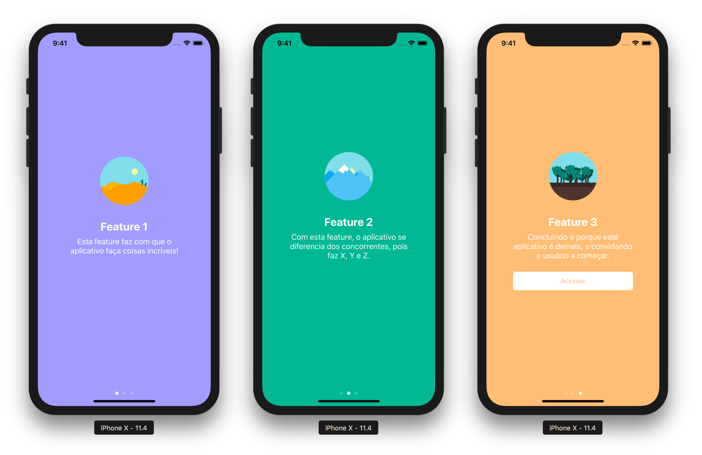

# Onboarding com UICollectionView e Storyboard

Neste projeto mostro como criar um processo de onboarding no iOS usando UICollectionView e desenhando as interfaces no Storyboard.

É o projeto de exemplo para um post detalhado onde explico o que foi feito: [Criando onboarding com UICollectionView e Storyboard](http://marcosatanaka.com/blog/onboarding.html).
